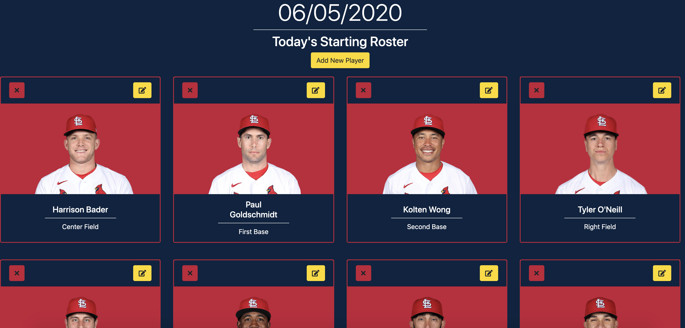
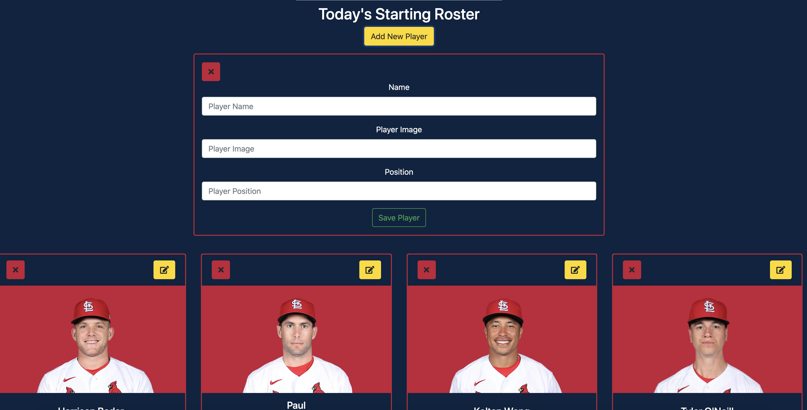
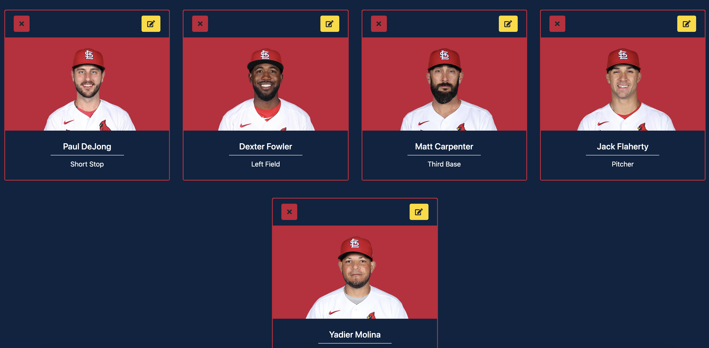
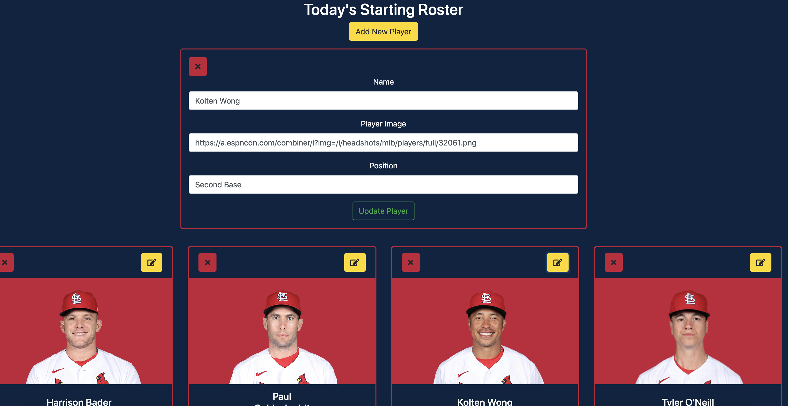

# Description
Log in to this app and see the St. Louis Cardinals' starting roster for the current day.  This is a simple React app that demonstrates full CRUD.  A user can add his or her own player to the starting roster, edit any attributes for a given player, and also completely remove any player from the roster.

# Screenshots

# How To Run
1. Clone down this repo
2. Make sure you have http-serve installed via npm. If not, get it HERE.
3. On your command line run hs -p 9999
4. In your browser go to http://localhost:9999